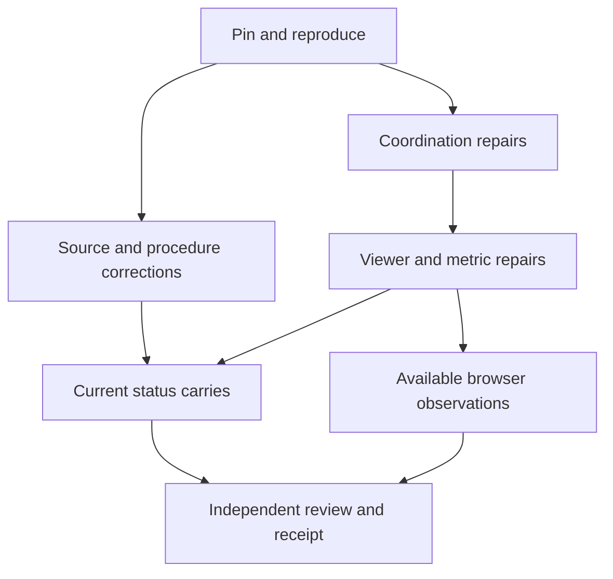

# Repository update pass 3: close remaining consumer and control gaps

**Status:** EXECUTED locally under “Proceed with pass 3.” Thirty scoped paths are reconciled; required synthetic checks and independent review pass. Browser/device observations, the frozen-editor condition, demonstrated HCC overlap and Cargo A4 remain explicitly pending. Changes are uncommitted; release is not promoted.
**Instructions:** “Plan pass 3,” then “Proceed with pass 3.” **Date:** 2026-09-20. **Editor / station:** Codex / maps, session `95fe3444c11b`.
**Base:** `e14b13c08fbfe6c280e9f0460d383a6be4479865`, local main equal to origin/main after fetch and ff-only pull.
**Question:** Can the remaining current consumers and operating controls be reconciled with their actual sources and behavior, with every unresolved decision and unobserved result still identifiable?
**Evidence:** [pass 3 planning record and execution receipt](repo-update-pass-3-evidence.md#8-execution-dispositions). **Inherited work:** [pass 2 dispositions](repo-update-pass-2-evidence.md#8-execution-dispositions), [pass 1 arrival and custody map](repo-update-pass-1-evidence.md), [context](../prompts/context-pass.md).

## 1. Measured before proposing

The base has **566 tracked paths, 489 Markdown files, 13 path families and 17 remote branches**. All sixteen non-main tips are unchanged from pass 1. The previous content-integration classifications still apply; no missing-content integration backlog was established. Passes 1 and 2 published nineteen station commits affecting 77 distinct paths. Pass 2 alone published 43 files in eleven commits. These are inventory, arrival and edit counts, not semantic-review coverage.

The checker exits 0 with **80 advisories: seven direct-index warnings and 73 commits without an actor trailer in the current 200-commit window**. Its present count is accurate, but a two-commit counterexample exposes a false-pass in the counting algorithm. Existing 23 runtime and 15 coordination regressions passed during pass 2; they do not cover the newly identified failures.

The four canonical PNGs were visually inspected again for this planning turn. Graphic A13 and B12.2 preserve occurrences; Graphic D1 is the eleven-row specimen; D2/D3 permit only earlier references; D4 distinguishes projection from storage. No physical cord operation was performed. The [manifest](../systems-manifest.md), [law](../law-why-these-documents.md) and accepted conceptual-reference correction remain governing sources.

**Thesis `[PROPOSAL]`:** the admitted defects can be corrected through bounded current-document qualifications and maintenance of existing Layer III tools. No new Core mechanism, acceptance, branch integration, production carrier or release is needed to close those local defects.

**Falsifiers:** a proposed ownership repair silently changes a valid tracked owner; a reported fix still passes the original counterexample; a missing proof becomes a refutation or an admission; a source sighting becomes a build/device claim; or a current status correction rewrites historical evidence. Stop or narrow that batch and record the failure. Independent work continues.

## 2. Preserve independent evidence fields

Use the questions already established in pass 1. This is a receipt format for this campaign, not a new repository authority or runtime store.

| Field | Required evidence |
|---|---|
| Commit ancestry | Named base/tip and reachable history |
| Content arrival | Exact patch/blob/current-destination correspondence where ancestry differs |
| Source agreement | Claim, controlling passage, domain/premises and comparison |
| Work performed | Actual product and source/synthetic/browser/device result, separately stated |
| Human acceptance | Exact retrievable human statement, content identity and scope; otherwise absent or unresolved |
| Publication and release | Published main SHA separately from promoted pointer, installed URL and observed client |

HCC-A, Coffee Cup and Water are conceptual reference documents. That accepted classification does not supply an emitter. The current release remains **ixp2 / `3b619929182e98ccaa348a2fc696b98c2e416a2e`**. Of pass 2's inspected 21 launch/linked assets, six now differ on main. The old pin has not received those repairs.

## 3. Planning and execution boundaries

**Original planning-turn boundary:** only this plan, `repo-update-pass-3-evidence.md`, and `docs/plans/README.md` were written under maps. No executable repair, fixture addition, commit, push, deployment or installation was performed in that turn.

**Execution authorized by “Proceed with pass 3” covers:** the exact documentation work and bounded shell/HTML/JavaScript/WGSL repairs in §4 and §5, including the two specified new first-party shell regression files. They exercise existing steward/Layer III behavior. They do not implement Core, introduce dependencies, or create CI. Actual dispositions and unchanged conditional targets are recorded in the evidence; the reserved boundaries below still apply.

Execution and publication remain distinct under this campaign's Plan → Proceed → Commit cadence. Prior “Push all” instructions published the prior work; this plan does not retrospectively enlarge that publication. A later publication instruction may use the connected GitHub integration that published passes 1 and 2, preserving station scope and reviewed file trees.

**Reserved boundaries:**

- `docs/shadow-clock-gearing.html` requires the human-named designated editor session specified in [CLAIMS.md](../gearing/CLAIMS.md). Its prepared pass 2 patch remains conditional; a general execution instruction or renderer claim alone does not provide that designation.
- Canonical PNGs, supplied source files, live model law, staking, manifest and emission Answer/Stamp lines remain read-only. The only proposed `AGENTS.md` change is the existing Coordination doctor-command shorthand, to carry its actor argument; no authority or acceptance rule changes.
- `LATEST.json`, web app manifest identity/start/scope, icons, lookrefs, IR fixture data and all eight contract-data shafts remain unchanged. `RESYNC.md` may receive a stewardship command example only, outside its live metadata block. No live signal or other agent's claim is a test fixture.
- No source/encoding/ABI/Core implementation, `.wat` or Cargo fixture, branch birth, source import into Git, dependency download, GitHub Actions, hosting-policy change or release promotion.

## 4. Work packages and falsifiable completion tests

### 2a. Admit the current delta and establish the repair baseline

Reanchor and compare changes since this base. Reuse unchanged branch dispositions; investigate a changed branch or disputed hunk individually. Record current owners and claimed paths. Inspect the exact source functions and capture each original counterexample before modifying it. Existing ownership commands must be invoked with canonical repository-relative paths while their repair is pending.

**Done:** every admitted P3 finding has its original observation, source/function locator, owner, permitted files, expected result and residual boundary. Newly discovered dependencies require a recorded scope amendment before editing; they do not enlarge reserved authority.

### 2b. Reconcile procedure, source and status consumers

**P3-06, P3-07, P3-09, P3-10; maps, clipboards, hologram, prompts and law entrances.**

1. Complete environment **E7** against its existing E3/E6 predicates. F-G/F-B must be checked beyond the branches exercised by D1. Require evidence for all thirteen predicates over each predicate's existing E2/E3 domain before unrestricted IN-REGION; restricted-domain or D1-only evidence remains bounded. D1 remains a necessary specimen check. Preserve F-H5's final-gap versus per-STEP distinction: per-STEP counts need the stated S4.3 premise, whose inheritance this repair does not decide. Missing evidence stays UNESTABLISHED/BLOCKED as appropriate; a proved violation is distinct. Successful D1 already witnesses non-vacuity, so do not invent another search obligation. Preserve E3/E4/E5, recorded candidates/verdicts and the original receipt. Carry the exact procedural correction into the diagram prompt and current context only where needed.
2. Qualify execution-model **X7**'s release/acquire safety and “both surfaces” single-writer claims against the current compute proposal. State complete publication, memory order, carrier/reload and host premises; R9/R11 remain untaken. Do not choose an ordering protocol or repeat the already closed I1/M1/I6/M3 work.
3. Repair the WebGPU **M-G8/P-G8** locator chain: PDF218 is the Queue IDL; PDF222 is submit scheduling/nonreuse prose. Preserve the original sighting record by dating the new correction. Qualify historical FM-Wgpu3/D7 mispins through a current addendum, using PAGE F's already correct distinction. Do not declare WebGPU Pass 6 executed.
4. Carry completed Wasm **W2-S1–S6** into the clipboard index and rulings brief. Distinguish sighted grammar from complete provenance, configured validator enforcement and built artifacts. A4 remains next.
5. Correct current entrances for published pass 2, ordinary HCC/nostd source fixes and AB/BC/CA binding prose, while retaining the frozen gearing and browser/picker limits. Align the iteration-5 overview/index with recorded execution of passes 1–3; reuse of pass-4 extraction in iteration 6 does not close all of pass 4 or the iteration.

**Done:** exact before/after statements and source locators agree; current routes reach the corrected consumers; older receipts keep their historical content and scope. Source/readiness/acceptance/publication/release states are independently visible. A current qualification is not another completed historical campaign.

### 2c. Repair operating controls, then propagate their actual syntax

**P3-01, P3-02, P3-03; coord first, then kit and affected command consumers.**

| Repair | Required counterexamples and invariants |
|---|---|
| Canonical ownership | `docs/clock/../pointer-emission.md` must resolve to law or reject; it must never gate as hologram. The analogous coord-to-gears alias must not gate as coord. Normalize supported in-repo spellings consistently, or explicitly reject ambiguous forms. A symlinked file or parent must resolve to its target's owner or reject; outside-root/escaping targets must reject. Test dot segments, repeated separators, repo-absolute paths, new files and unknown shafts. Keep all symlink/target mutations inside a disposable fixture; no broad filesystem walk or new repository symlink policy |
| Component-aware patterns | Root-only `docs/*.md` and gearing `*.md`/`*.sh` must not claim arbitrary new nested shelves. Preserve exact known `docs/gearing/claims/README.md` ownership as gearing-meta, without giving all future gearing descendants a blanket owner. Compare all 566 tracked paths before/after; every changed owner needs an explicit justified disposition. Exact renderer, law and gear exceptions must survive |
| Doctor actor dispatch | Keep read-only `doctor` available. Make `doctor --auto-clear "<AgentName>"` require and forward the explicit actor to existing `resync.sh clear`. Reject missing actor before mutation. FIRED plus all nineteen FREE may clear the synthetic signal with that exact actor; any HELD/missing/unknown state prevents clearing. CLEAR/read-only cases do not mutate. Preserve the backend's actor requirement |
| Actor attribution metric | Count commits with at least one accepted trailer, not trailer lines. Two commits, one with two coauthor trailers and one unsigned, must report one unsigned. Cover mixed Agent/Co-Authored-By trailers, empty values, no trailers and a bounded history window. Keep `0 ≤ unsigned ≤ inspected commits`; preserve advisory exit behavior |

Use copies of the actual scripts, temporary Git repositories and constrained remote stubs. The actor fixture must run the copied actual `check-docs.sh`, with minimal inputs for its other checks, and assert its report and advisory exit status; reproducing the counting formula alone is insufficient. Check unrelated claim/signal bytes. The existing 15 force-free regressions remain a required guard for the shared coordination code. New fixtures are `docs/coord/tests/control-regressions.sh` and `.claude/tests/actor-attribution.sh`.

Carry the doctor signature into the coordination README/prompt, AGENTS Coordination shorthand and RESYNC stewardship example. Do not use a default anonymous actor, an expired-hold rule, a new allow-list or a live force-free. Keep orphan/reachability algorithms and direct-index grouping unchanged; their limitations stay documented in the receipt.

**Done:** baseline counterexamples fail under the intended assertions, repaired actual scripts pass, tracked ownership is accounted for, ordinary protocol semantics survive, and each current command example matches its tested invocation.

### 2d. Repair the remaining bounded viewer failures

**P3-04, P3-05, P3-08; hologram.** Extend the existing Node fixture, using actual source handlers and bake material data.

| Repair | Required behavior and evidence |
|---|---|
| Worker-message recovery | Malformed/null response or invalid typed-array buffer rejects the bake promise and cleans up the timer/worker exactly once; the existing fallback chain can continue. Cover valid response, error, timeout, late message and synchronous transport failure. Preserve geometry, D1 and worker/inline tessellation |
| Filament/plasma separation | Actual cyan filament material must reach filament treatment; green spheres retain plasma treatment. Derive the check from actual bake colors and shader predicate/order logic. Preserve birth visibility and pass roles. This proves classification under the tested predicates, not WGSL compilation or pixels |
| Truthful diagnostics and controls | `runAudit` must not call missing icons present or a 404/MIME-only manifest valid. Report the fact actually measured and pending/unknown states where unmeasured. WebNN context creation is labeled at that strength. A visible Update control must give an available/unavailable result even if service-worker registration rejects or the API is absent. Do not introduce a general capability framework |
| Bounded transport waits | The secondary worker-source fetch and release-pointer providers must settle under an explicit finite timeout/abort policy, with late results unable to reverse a settled outcome. Reuse the existing 2500 ms worker budget for its fallback-source request; use a documented finite per-provider release deadline, selected and justified during implementation. A pending/rejected provider cannot imply freshness or navigate to floating main. Test never-settling and late-success doubles, retained pin, retry and fallback progression |

**Done:** each original failure has a source-derived regression; the prior 23 checks and new cases pass with no unhandled rejection or stuck promise in the named scenarios. Test counts are reported as actual results after execution, not promised now. The existing SW cache isolation repair and release-selection identity checks remain intact. No cache architecture or manifest change is included.

### 2e. Complete available observations; keep gated work pointable

**P3-11 and P3-12.** Capability preflight first: identify an actually usable browser executable or already available browser service. Pass 2's failed launch is a dated observation, not a permanent impossibility claim. No browser download or general new harness is assumed.

If available, observe the actual current candidate at `t=2` and `t=10`; record revision, URL, camera, viewport, browser and adapter/backend. Inspect filament/plasma appearance, validation errors, REF-off/on failure/recovery, computed overlay visibility and Holder-link access. Verify HCC's persistent qualification at narrow and wide widths: its fixed header offset is a concrete overlap risk, not yet an observed failure. A confirmed overlap may receive a narrowly tested header/layout correction in `hcc-a-projection.html`; no scene redesign.

Offline observations, when available, name three separate cases: first uncontrolled visit then offline reopen; warmed controlled visit then offline reopen; and worker/REF/linked-view resource availability. Record the actual cached resource set. The two-icon precache, first-client behavior and cache-write lifetime remain limitations; this pass does not promise cold-offline readiness or perpetual operation.

The frozen gearing patch is already prepared in [pass 2 §10](repo-update-pass-2-evidence.md#10-prepared-frozen-renderer-edit). Apply only after the named-editor condition is met, under renderer. Preserve keys/contract bodies; inspect qualification while A8/B2/E1/E2 are selected. If designation is absent, leave the target unchanged and retain that exact pending work.

**Cargo A4:** absent from this corpus. If the requested source is subsequently supplied with clear identity, inspect only Cargo's `build-std` material for crate-list, lockfile and `rust-src` claims, record source silence and map into the existing rust-target clipboard. Otherwise retain the exact request. This neither starts a new six-pass campaign nor permits a build/R12 fixture.

**Done for this package:** every requested observation is recorded as observed, failed, blocked or NOT_RUN with its exact missing resource. A desktop software GPU is not physical Android evidence. Installation, pin-to-pin identity migration, production hosting and release promotion remain separate work.

### 2f. Resolve, review and receipt

For every P3 finding record source corrections, code changes, regression evidence, browser/device state, acceptance and release status independently. Append one dated coherence-audit tick. Link actual products and update current entrances after their dependencies have changed.

An independent reviewer must challenge each corrected mechanism against its original counterexample and the permitted scope. Run the existing repository checker, validate changed relative links/anchors and diff whitespace, verify exact file ownership and protected-byte invariants, gate each station, release claims and report the local handoff. Do not broaden tests once the named risk and required guards are resolved.

## 5. Exact execution candidate pool

These are upper bounds, not a requirement to edit every path. Paths are relative to the repository root; conditional paths remain conditional.

| Owner | Permitted paths and scope |
|---|---|
| maps | `docs/plans/repo-update-pass-3-plan.md`; `docs/plans/repo-update-pass-3-evidence.md`; `docs/plans/README.md`; `docs/coherence-audit-log.md`; `docs/plans/lace-context-iter6-pass-4-environment.md` E7; `docs/plans/reduction-pass-2-execution-model.md` X7; `docs/plans/reduction-pass-5-rulings-brief.md` source-status rows; `docs/plans/verification-iteration-5-plan.md` current entrance |
| law | `README.md` and `docs/README.md` current navigation/status; `AGENTS.md` Coordination doctor-command shorthand only |
| coord | `docs/coord/coord.sh`; `docs/coord/README.md`; **new** `docs/coord/tests/control-regressions.sh` |
| kit | `.claude/hooks/check-docs.sh` actor-count section only; `.claude/README.md`; **new** `.claude/tests/actor-attribution.sh` |
| gearing-meta | `docs/gearing/RESYNC.md` current stewardship command example only; preserve live metadata and dated history |
| prompts | `docs/prompts/coord-protocol-prompt.md`; `docs/prompts/lace-context-diagram-prompt.md`; `docs/prompts/context-pass.md`, limited to corrected procedure/command/result carries |
| hologram | `docs/clock/lace-projection.html`; `docs/clock/tests/runtime-regressions.mjs`; `docs/clock/tests/README.md`; `docs/clock/README.md`; `docs/hologram/README.md` |
| clipboards | `docs/clipboards/webgpu-mechanisms.md`; `docs/clipboards/webgpu-ascii-machinery.md`; `docs/clipboards/webgpu-clipboard.md`; `docs/clipboards/README.md` |
| renderer, conditional | `docs/shadow-clock-gearing.html` under named designation; `docs/clock/hcc-a-projection.html` only for a demonstrated header/layout overlap |
| clipboards, conditional A4 | `docs/clipboards/rust-target-clipboard.md`, a dated source-to-claim addendum only after the requested source is available |

The original pass 1/2 receipts and census remain historical. This pass's evidence and current index can record their publication without rewriting the earlier uncommitted handoff.

## 6. Sequence and completion

Use disjoint station owners concurrently where dependencies permit; serialize the same file. The source/procedure and control/runtimes are independently reviewable. Final status carries follow actual results. Missing browser, A4, frozen-editor designation or human rulings cannot stall unrelated authorized repairs, and cannot be relabeled as passed.

**Local completion criterion:** every admitted finding has a bounded disposition, all authorized source/code repairs satisfy their named tests, exact changes are reviewed, all claims are released and remaining conditions are explicit. **Planning completion was reached before Proceed:** that handoff recorded execution as NOT_RUN; the later execution receipt supplies current results without rewriting its dated observations.

**Human decision frontier:** retain the five SPOKEN custody locations and separate occurrence conflicts; emission acceptance and σ ownership; R1/R6 build/representation; R3/R4/R5/R9/R11 lifecycle/concurrency; and production/#14-R10/#15 questions only when the next task depends on them. No need to take all rulings to repair a viewer or an ownership dispatcher.

The shoe remains the court. No planned or synthetic result writes a POINTER or accepts an emission rule.
