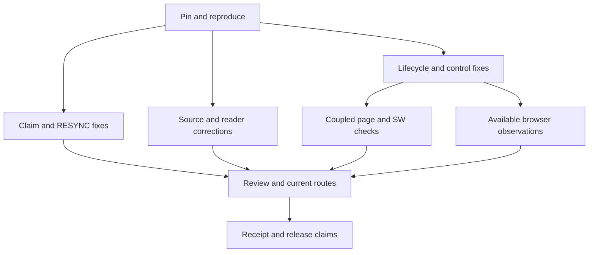

# Repository update pass 4: reconcile behavior across control and reader boundaries

**Status:** EXECUTED locally, with conditional observations/work pending at their stated boundaries. The human instructed “Proceed with pass 4” on 2026-09-20. Planning observations below remain dated evidence; actual dispositions follow in the [evidence](repo-update-pass-4-evidence.md#11-execution-dispositions).
**Instruction:** “Plan pass 4.” **Date:** 2026-09-20. **Editor / station:** Codex / maps, session `95fe3444c11b`.
**Base:** `335429cc0352c2e93c8009c6db57dd977ec783bb`, main equal to origin/main after fetch and ff-only pull.
**Question:** Can the remaining demonstrated mismatches between existing operations and their stated contracts be closed, while source evidence, human decisions, publication and observed client behavior retain their distinct scopes?
**Evidence:** [pass 4 measurements and counterexamples](repo-update-pass-4-evidence.md). **Inherited:** [pass 3 execution](repo-update-pass-3-evidence.md#8-execution-dispositions), [current context](../prompts/context-pass.md), [decision route](reduction-pass-5-rulings-brief.md).

**Subsequent source arrival, 2026-09-20:** Cargo A4 arrived with the later “Push all” instruction. The already-authorized conditional mapping is recorded in [evidence §16](repo-update-pass-4-evidence.md#16-subsequent-cargo-a4-arrival-and-publication-preparation). Earlier absence statements below describe planning and the original execution handoff; no new path, build, fixture or ruling is admitted.

## 1. Measured before proposing

The published base contains **570 tracked paths, 491 Markdown files and 1,134 reachable commits** across the same thirteen path families. All sixteen non-main tips remain unchanged among seventeen remote-tracking branches. Pass 3 published thirty files in eight linear station commits, each carrying its matching actor trailer. No new missing-content integration backlog was established.

The current checker exits0 with **72 advisories: seven direct-index warnings and 65 unsigned commits among the last 200**. The eight new attributed commits displaced eight unsigned ones; no old commit gained attribution. The existing **51 runtime, 36 control, 15 override and six actor checks** retain their pass3 receipts. This planning turn runs targeted counterexamples, not a new broad-suite certification.

Five runtime scenarios expose interactions absent from that coverage: cached release data can defeat a no-store request; quick resume can suppress recovery after teardown; suspended asynchronous boot can publish a hidden session; fallback controls can disagree with their timeline; and a rejected install prompt can escape its handler. Fourteen isolated control cases expose malformed claim admission, false-success RESYNC reporting, actor serialization and usage redirection. Six freshly viewed source pages support three narrow reference corrections. Exact methods and limits are in the evidence.

Root reopened all four canonical PNGs. Graphic A13/B12.2 preserve occurrences; D1 supplies the eleven-row specimen; D2/D3 constrain references to earlier rows; D4 separates projection from storage. Physical cord testing was NOT_PERFORMED. HCC-A, Coffee Cup and Water remain conceptual references. No schedule or Core acceptance follows from their classification or this pass.

**Thesis `[PROPOSAL]`:** these admitted failures can be repaired within existing Layer III scripts/viewers and derived-document consumers, preserving the current model, release identity and reserved decisions.

**Falsifiers:** an original counterexample still violates its named outcome; a fix changes a valid station owner or established protocol case without justification; a coupled page/SW test still reports freshness from the stale pointer; hidden work can publish a live GPU session; or a source/doc correction silently changes an algorithm, human stamp or historical receipt. Stop or narrow that batch and record the exact failure; independent work may continue.

## 2. Authorization and preserved boundaries

**This planning turn may write only:** this plan, `repo-update-pass-4-evidence.md`, and `docs/plans/README.md`, under maps. Baseline probes use disposable copies or controlled execution of actual sources. No proposed repair, new repository fixture, commit, push, install or release promotion is performed.

**A later instruction to execute this plan covers:** the exact documentation and bounded shell/HTML/JavaScript repairs in §§3–4, including extension of the two existing control/runtime fixtures. Publication remains a later step under Plan → Proceed → Commit; the previous “Push all” published pass3. No new dependency, framework or CI is proposed.

Preserve canonical PNGs, supplied attachments, AGENTS, live model law, staking, systems manifest, pointer-emission Answer/Stamp lines, algebra, environment and execution-model definitions. The derived `graphics-close-reading.md` correction is confined to §3. The inherited Φ-domain notation uncertainty is recorded in the evidence; this pass does not choose its operand domain, arity, order or emission semantics.

Preserve `LATEST.json`, manifest identity/start/scope, icons, lookrefs, worker source/geometry, inline bake geometry, D1, IR fixtures and all eight contract-data shafts. The SW may receive only the specified release/no-store cache-policy correction. No automatic cache purge, new offline carrier, Core/ABI/encoding code, Cargo/WAT fixture, package/browser download, branch birth, source import into Git or production-host exception.

Existing claim files and RESYNC live metadata are protocol state, never test fixtures. New claim guards enforce the already documented FREE-or-same-holder admission contract. The narrow backend repairs do not change shaft ownership, expiry, override authority or the human-only force-free rule. All ordinary successful cases and earlier dispatch/reason fixes remain required guards.

The frozen gearing viewer still requires the human-named designated editor session in [CLAIMS.md](../gearing/CLAIMS.md). A general execution instruction does not supply that designation. HCC layout changes remain conditional on a demonstrated overlap. Cargo A4 remains conditional on receiving the identified source. These conditions do not block other authorized repairs.

## 3. Work packages and completion tests

### 2a. Reanchor, reproduce and retain the original failures

Compare the execution base with this pin and admit any intervening delta explicitly. Reuse unchanged branch dispositions; investigate only changed tips or disputed content. Resolve owners, claim the exact station, and preserve initial protected/source bytes.

Turn the recorded planning probes into regressions in the existing fixtures before repairing their sources. The runtime tests must exercise actual lifecycle handlers and actual page→SW fetch dispatch, not replace the failing decision with a separately copied formula. Control tests must run copied actual scripts with private claims/signals/cwd sentinels and constrained Git stubs. Each admitted original failure needs a failing baseline assertion and a passing repaired assertion.

**Done:** P4-01–P4-13 each have an actual or conditional disposition, source/function locator, owner, exact permitted paths, failure criterion and residual boundary. Scope changes require a recorded amendment before editing and cannot expand reserved authority.

### 2b. Repair coordination admission and RESYNC reporting

**P4-05/P4-06; coord and gearing-meta, serialized source/fixture handoffs.**

| Repair | Required behavior and tests |
|---|---|
| Claim admission in both `cmd_claim` implementations | Permit FREE and HELD by the same valid recorded holder. UNKNOWN/missing STATUS and HELD with an empty holder reject without writes. Preserve ordinary FREE admission, same-holder reclaim and other-holder refusal; retain existing ownership and BASE behavior |
| RESYNC fire outcome | Report FIRED only after successful supported block replacement or heading-based initialization. A file with neither block nor supported heading rejects without changing bytes or reporting success. Cover existing-block fire, heading-only initialization, absent anchor, clear and preserved history |
| Actor serialization | Preserve literal backslashes, apostrophes, Unicode and other single-line text exactly. Reject actual CR/LF before fetch/write because those characters split the metadata fields. Use literal replacement semantics; introduce no actor-name allowlist or new authority rule |
| Usage | No arguments or an unknown command prints safe usage and exits nonzero without shell redirection or writes. Include a synthetic cwd file named `agent` to expose the original redirection, and check cwd/script/history sentinels |

Extend `docs/coord/tests/control-regressions.sh`, which already copies all three scripts. Keep the existing **36 control and 15 force-free cases** passing. Update the coordination README with the actual semantics and fixture scope. `CLAIMS.md` already states the correct admission rule and remains unchanged; RESYNC metadata and its dated prose remain unchanged in the repository.

**Done:** all fourteen recorded malformed cases have the intended rejection or literal-preservation outcome, valid paths still work, and no unrelated synthetic or live state changes. The supplied actor authenticates nobody; it supplies custody text only.

### 2c. Repair lifecycle, update and visible-control interactions

**P4-01–P4-04; hologram.** Extend `runtime-regressions.mjs` with controlled lifecycle, deferred GPU promises, actual SW fetch dispatch and install-event doubles. Preserve all **51 existing cases**.

| Package | Required behavior and falsifiable completion |
|---|---|
| **P4-01: lifecycle** | A destroyed session cannot have its only recovery suppressed by the 900ms debounce. Two quick hidden→visible cycles, including after watchdog use, recover without an unrelated focus event. Hide/pagehide/freeze invalidates pending boot work: late adapter/device acquisition cannot publish a hidden/stale session or RAF, and a late acquired device is released. Visible return starts an eligible generation; stale completion cannot overwrite it. Preserve REF/camera/time intent and avoid duplicate sessions or frame scheduling |
| **P4-02: page→SW release freshness** | The third same-origin release request must bypass stale CacheStorage when requesting fresh data. With the first two providers rejected and an old valid cached pointer, an available newer network pointer selects its exact SHA; an unavailable network retains the pin and reports release unavailability rather than freshness from that old cache. Test actual page fetch through the actual SW handler. Preserve identity/path/SHA validation, 2500ms fetch/body budgets, retry and unrelated/pinned cache contents |
| **P4-03: fallback control truthfulness** | Scrubbing updates the phase and reference selection from the same `tVal` even without GPU submission. Playback must have one effective timeline owner: either a functioning GPU-independent display clock or an explicitly paused/unavailable control during fallback. Choose the smallest implementation consistent with the existing UI, record that choice before editing, and test absent GPU, post-error fallback, manual scrub, play/pause and recovery without double advancement. A button saying pause while nothing advances cannot count as completion |
| **P4-04: install-event failure/custody** | Consume the promise returned by `prompt()` before depending on `userChoice`; a prompt rejection must settle the click, display a truthful failure and cause no unhandled rejection. Preserve one-use event custody through accepted/dismissed choice and repeated clicks. A new install event arriving while the previous prompt/choice is still pending must survive completion of that older operation; no event may be consumed twice. Tests do not perform an installation or claim installability |

Keep source changes inside existing control/lifecycle/fetch/installation paths. A broader GPU acquisition deadline, cache redesign or offline guarantee is not established as necessary by these counterexamples. Record any dependency that makes a proposed narrow repair insufficient before enlarging the batch.

**Done:** source-derived baseline failures reject the old code and pass on the repair, the existing51 guards still pass, no named scenario leaves an unintended live/hidden session, stuck click or unhandled rejection, and the README describes exactly what was exercised. Synthetic sessions and timers remain separate from browser scheduling and GPU/device evidence.

### 2d. Reconcile source locators and current document consumers

**P4-07–P4-12; clipboards, graphics, kit, maps and current entrances.**

1. **WebGPU GPUTexture:** PAGE D/per-page summary point to **PDF66**, matching existing M-G4/P-G4. Add a dated qualification for old approximate222/FM-Wgpu4 references; preserve original sightings. Do not alter the already correct submit **IDL218/prose222** chain.
2. **WGSL discard:** M-S5/P-S5 distinguish **PDF158 rule** from **PDF159 worked example**. Qualify PAGE E's approximate pin in the clipboard. Preserve the original158–160 method receipt, the correct159 example cite, and the rule's helper-invocation/effect scope; no immediate-function-termination interpretation or campaign completion.
3. **WebNN issues:** M-N6's current OPEN label identifies Issues5/7 as **execution-error reporting**, with dated qualification of clipboard historical repeats. PDF32's output-readback completion route stays explicit, separately from dispatch's lack of a direct signal. No API implementation, inference result or R10 admission follows.
4. **Graphic D1 reader:** in `graphics-close-reading.md` §3, label the four pairs as consecutive WORD-subsequence occurrences, not adjacent raw indices. Label `0,1,1,2,2` as final POINTER gaps between WORD rows and after the last WORD. Per-STEP interpretation retains the existing S4.3 premise. Recount D1 and reuse M3's alternative partition; preserve the supported consecutive-pair/fixed-fan-out refusals with their actual premises, without proposing an emitter.
5. **Install guidance:** qualify the two current `githack-pwa-deploy.md` operational claims. Update selects a pinned URL; same-installation/icon migration still needs an observation. Checking host/full-SHA is a diagnostic step, not an exhaustive explanation of every failed install. Preserve the host/SHA law, original dated install evidence and unresolved production exception.
6. **Current routes/publication:** carry pass3's actual eight commits/30 paths into this pass's evidence and current index. Preserve its local-handoff receipts. After execution, update current root/docs/context and clock/hologram entrances to distinguish performed repairs, synthetic evidence, pending observations and unchanged release. The planning turn updates only the plans index.

**Done:** each current consumer agrees with its exact cited passage and scope. Historical receipts remain historical; the six-page sighting neither closes WebGPU/WGSL Pass6 nor re-executes WebNN's completed campaign. Cross-file evidence carries add no authority, stamp or decision.

### 2e. Record available observations and gated work

**P4-13.** At execution, identify an actually usable browser executable or service before scheduling observations. Planning finds no advertised browser tool, no browser on PATH, and no installed binary at the bundled Playwright paths; pass3's failed launch remains a dated result. No download or new browser harness is included.

If available, observe the exact candidate revision/URL with browser, viewport, camera and adapter/backend recorded: `t=2`/`t=10` material appearance, validation errors, two quick lifecycle cycles, pending acquisition/suspension recovery where controllable, REF-off/on recovery, fallback control state and Holder-link access. Inspect HCC at narrow/wide widths; only a demonstrated header overlap permits its bounded layout correction. Desktop software GPU and emulated viewport results are not physical Android evidence.

Keep offline observations separate: first uncontrolled visit/reopen; warmed controlled visit/reopen; worker/REF/linked-view availability with the actual cached resource set. The two-icon precache, first-client and cache-write-lifetime limits remain. No perpetual-offline claim or carrier implementation is planned.

The [prepared frozen-renderer patch](repo-update-pass-2-evidence.md#10-prepared-frozen-renderer-edit) remains conditional on named-editor designation. If that condition arrives, apply it under renderer, preserve contract keys/bodies and inspect A8/B2/E1/E2 qualification. Otherwise record NOT_APPLIED without repeating an unproductive edit attempt.

Cargo A4 remains absent. If the requested source arrives with clear identity, map only `build-std` crate-list, lockfile and `rust-src` support into a dated rust-target addendum. No source-silent answer, Cargo/WAT fixture, R12 permission or build follows. Installation, identity migration, production hosting and LATEST promotion remain separately authorized work.

**Done for this package:** each requested observation has an observed/failed/NOT_RUN or conditional disposition naming its missing prerequisite. No unavailable capability can become a passing result or stall unrelated repairs.

### 2f. Independently challenge, validate and receipt

Assign separate reviewers to controls, runtime and source/procedure changes. Require original counterexample reproduction and full named guards after changes; report actual totals, not a promised future test count. Preserve protected bytes, section scopes and earlier fixtures. Run the repository checker, resolve changed relative links/anchors, check whitespace and exact ownership, append one dated coherence tick, gate each station and release claims.

Record expected versus actual for every finding, exact file manifest, baseline and repaired checks, source/pages, browser/device state, human acceptance and release status. Reviewer agreement does not grant acceptance. Stop when the admitted work is verified or its exact conditional boundary is recorded; do not begin another survey to inflate coverage.

## 4. Exact execution candidate pool

These are upper bounds, not a requirement to touch every file. **Twenty-six unconditional candidates across nine stations; three conditional paths.** Planning itself writes only the first two documents and plans index.

**Execution amendment, 2026-09-20:** the supplied rustc book exactly matches the previously mapped A1 hash. Under the evidence's [recorded source-carry amendment](repo-update-pass-4-evidence.md#10-execution-reanchor-and-choices), the rust-target clipboard may receive a dated A1 re-sighting/availability addendum. A4 remains absent. This makes27 admitted paths, with the two renderer paths still conditional; it does not authorize a build or source import.

| Station | Permitted paths and scope |
|---|---|
| maps | `docs/plans/repo-update-pass-4-plan.md`; `docs/plans/repo-update-pass-4-evidence.md`; `docs/plans/README.md`; `docs/coherence-audit-log.md` (one append) |
| coord | `docs/coord/coord.sh` claim admission; `docs/coord/README.md`; `docs/coord/tests/control-regressions.sh` |
| gearing-meta | `docs/gearing/claim.sh` claim admission only; `docs/gearing/resync.sh` fire/clear serialization/outcome and usage |
| hologram | `docs/clock/lace-projection.html`; `docs/clock/sw.js`; `docs/clock/tests/runtime-regressions.mjs`; `docs/clock/tests/README.md`; `docs/clock/README.md`; `docs/hologram/README.md` (last two current results/limits only) |
| clipboards | `docs/clipboards/webgpu-clipboard.md`; `docs/clipboards/wgsl-mechanisms.md`; `docs/clipboards/wgsl-ascii-machinery.md`; `docs/clipboards/wgsl-clipboard.md`; `docs/clipboards/webnn-mechanisms.md`; `docs/clipboards/webnn-clipboard.md`, at the named sections/dated qualifications only |
| graphics | `docs/graphics-close-reading.md` §3 only; canonical PNGs unchanged |
| kit | `docs/kit/githack-pwa-deploy.md`, two operational qualifications only |
| law | `README.md`; `docs/README.md`, current navigation/status only; AGENTS unchanged |
| prompts | `docs/prompts/context-pass.md`, current results/publication carry only; E7 procedure unchanged |
| renderer, conditional | `docs/shadow-clock-gearing.html` under named designation; `docs/clock/hcc-a-projection.html` only after demonstrated header/layout overlap |
| clipboards, conditional A4 | `docs/clipboards/rust-target-clipboard.md`, dated source mapping only after the identified source arrives |

No checker-algorithm change, new repository test file, new authority document or historical pass1/2/3 receipt rewrite is proposed.

## 5. Sequence, evidence and stop

The two coordination stations can implement disjoint files; serialize final shared-fixture changes. Hologram changes share the same page and fixture and need one editor or an explicit file handoff. Current result carries follow the work they describe.

| Field | Actual at planning handoff |
|---|---|
| Arrival/inventory | Published335429c, 570 paths/491MD; sixteen non-main tips unchanged |
| Source observations | Four canonical PNGs reopened; six reference PDF pages freshly viewed |
| Counterexamples | Fourteen copied-script baseline cases and five actual-source runtime scenarios; repairs NOT_RUN |
| Protected material | Read-only; no model, source attachment, release or live signal mutation |
| Browser/device/physical | Browser/GPU/device/offline NOT_RUN; physical cord NOT_PERFORMED |
| Human decisions | No new emitter acceptance, custody locator, concurrency/encoding/hosting ruling or renderer designation |
| Publication | Prior pass3 verified published; no pass4 commit/push in this turn |

**Planning stop:** the three permitted planning files are complete, independently reviewed and linked; their maps gate passes and the claim is released. **Execution stop:** each admitted finding has a tested repair or exact conditional disposition, the scoped file manifest and evidence are reviewed, and all claims are released. No planning result writes a POINTER.

## 6. Actual local execution

All27 admitted paths were used, across nine stations, under the recorded A1-only source amendment. The existing fixtures now pass **74 runtime,75 control and15 override cases**. Against335429c, the final runtime fixture passes51/fails23 and the final control fixture passes53/fails22; all original51/36 guards still pass on that baseline. Independent challenge and preservation results are in the [execution receipt](repo-update-pass-4-evidence.md#12-executable-checks-and-independent-challenge).

Source/reader/operational qualifications are reconciled, current entrances distinguish the published pass3 baseline from local pass4, and A1's exact source availability is restored without treating it as Cargo A4. Browser/device/offline observations remain NOT_RUN; frozen gearing remains NOT_APPLIED without a designated editor; HCC overlap is unobserved. Protected model, source attachments and pinned release remain unchanged. No pass4 commit or push occurred during execution; final station release and exact scope are recorded in the [handoff](repo-update-pass-4-evidence.md#15-final-review-and-local-handoff).
